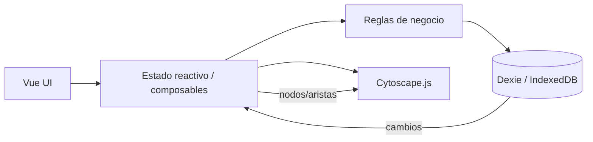
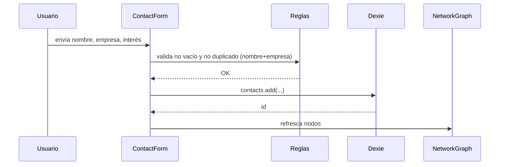
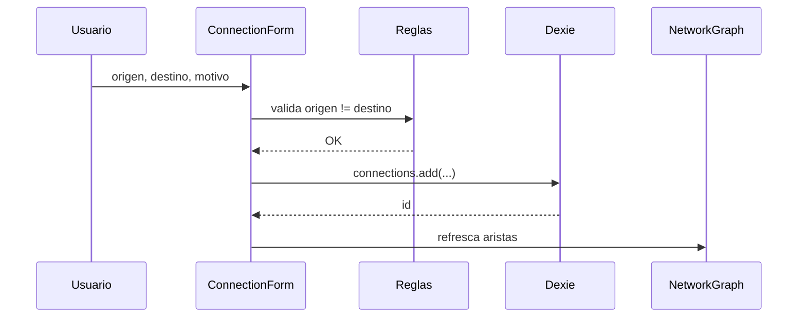
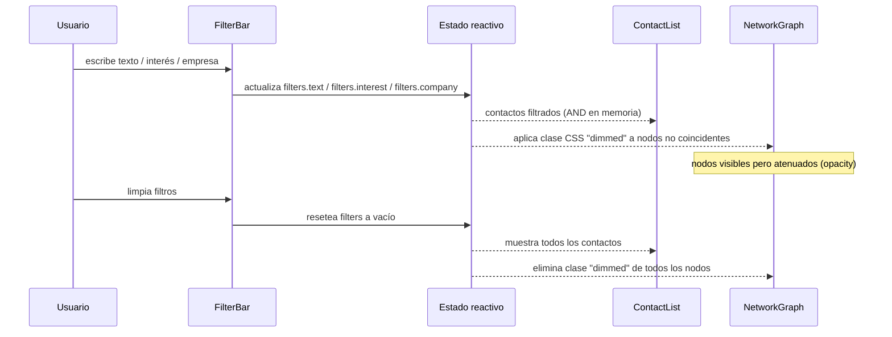

# Documento de Diseño

## Resumen

Network Map Lite es una SPA sin backend que corre íntegramente en el navegador. Usa Vue 3 (build global vía CDN) como capa reactiva de UI, Tailwind CSS (CDN) para estilos utilitarios, Dexie.js como wrapper de IndexedDB para persistencia local, y Cytoscape.js para renderizar el grafo interactivo de contactos y conexiones. Un solo archivo `index.html` más un pequeño `app.js` y `styles.css` opcional.

## Arquitectura

Arquitectura en tres capas simples dentro del navegador:

- **Capa de presentación (Vue):** formularios, listas, filtros y barra de acciones. Estado reactivo con `ref`/`reactive`.
- **Capa de dominio/aplicación (Vue composables + JS plano):** validaciones, reglas de negocio (duplicados, origen≠destino), coordinación entre persistencia y grafo.
- **Capa de persistencia y visualización:**
  - Dexie.js sobre IndexedDB para contactos y conexiones.
  - Cytoscape.js para el grafo, alimentado desde el mismo estado reactivo.



## Componentes

- **AppShell:** layout principal, dos columnas (panel de gestión + panel de grafo).
- **ContactForm:** creación y edición de contacto (nombre, empresa, interés).
- **ContactList:** listado, selección, edición y borrado. Muestra resultado de filtros.
- **ConnectionForm:** selección de origen, destino y motivo; valida origen≠destino.
- **FilterBar:** campos de interés, texto de búsqueda y empresa.
- **NetworkGraph:** wrapper de Cytoscape.js. Recibe nodos y aristas; se re-renderiza al cambiar datos.

## Flujos

### Alta de contacto


### Creación de conexión


### Filtrado
Los filtros se aplican en memoria sobre la lista cargada de contactos. El grafo siempre contiene todos los nodos y aristas; los nodos que no coinciden con los filtros activos se atenúan con estilos de Cytoscape (`opacity`).



## Modelo de Datos

IndexedDB vía Dexie.js. Dos tablas.

```js
db.version(1).stores({
  contacts: '++id, name, company, interest, [name+company]',
  connections: '++id, sourceId, targetId, reason'
});
```

- **contacts**: `id` (autoincremental), `name` (string, obligatorio), `company` (string, obligatorio), `interest` (string, opcional). Índice compuesto `[name+company]` para detectar duplicados.
- **connections**: `id` (autoincremental), `sourceId` (FK a contacts.id), `targetId` (FK a contacts.id), `reason` (string).

Reglas de integridad:
- `name` y `company` no vacíos.
- No duplicado por `[name+company]`.
- `sourceId !== targetId` en conexiones.
- Al eliminar un contacto se eliminan sus conexiones.

## Interfaces e Integraciones

- **Vue 3 (CDN, build global):** reactividad y plantillas declarativas. Sin build step.
- **Tailwind CSS (CDN):** utilidades de estilo. Sin compilación.
- **Dexie.js (CDN):** wrapper de IndexedDB. Abstrae apertura, versionado y queries.
- **Cytoscape.js (CDN):** renderizado de grafo. Configuración con `elements` (nodes+edges), `layout` (ej. `cose` o `grid`), y estilos por selector.
- **Sin backend, sin red.** Todo el estado vive en el navegador del usuario.

## Manejo de Errores

- Validaciones de formulario muestran mensajes inline (nombre requerido, empresa requerida, duplicado, origen≠destino).
- Errores de IndexedDB (ej. cuota, navegador en modo privado sin persistencia) se capturan con `try/catch` alrededor de las operaciones Dexie y se muestran como notificación no bloqueante.
- Si Cytoscape.js no está disponible (CDN falla), se muestra un mensaje de fallback y la app sigue operativa en modo lista.

## Seguridad

- Sin backend ni autenticación: la app es single-user local.
- Sin secretos embebidos.
- Sin llamadas de red salientes (las CDN son recursos estáticos de solo lectura).
- Datos limitados al origen del navegador (same-origin IndexedDB).

## Observabilidad

- Logging mínimo en consola (`console.info`/`console.error`) para eventos clave: alta/edición/borrado de contacto, alta de conexión, errores de Dexie.
- Sin telemetría externa ni sistema de métricas: fuera de alcance del MVP.

## Estrategia de Pruebas

- **Pruebas manuales:** checklist sobre los 5 requisitos (alta válida, alta inválida, duplicado, edición, borrado con cascada de conexiones, creación de conexión válida e inválida, filtros individuales y combinados, refresco del grafo tras cada cambio).
- **Property-based testing (ver sección Propiedades de Correctitud):** invariantes sobre las reglas de negocio con fast-check.
- **Sin pruebas E2E automatizadas** en el MVP para mantener el alcance pequeño.

## Decisiones y Alternativas

- **Vue 3 CDN en lugar de build con Vite:** el requisito pide SPA simple sin tooling; CDN evita `npm install` y build.
- **Dexie.js en lugar de IndexedDB directo:** reduce drásticamente el código de apertura, versionado y queries.
- **Cytoscape.js en lugar de canvas propio o D3:** el grafo interactivo con layout automático es exactamente lo que Cytoscape resuelve; D3 requeriría mucho más código para el mismo resultado.
- **Grafo siempre completo con atenuación por filtros:** mantener todos los nodos preserva la vista relacional; atenuar comunica el filtro sin destruir contexto.
- **Un solo archivo `index.html` + `app.js`:** minimiza estructura y facilita copiar/pegar sin tooling.

## Trazabilidad con Requisitos

| Requisito | Criterios cubiertos | Componente principal | Persistencia | Visualización |
|---|---|---|---|---|
| 1. Registrar contacto | 1.1, 1.2, 1.3, 1.4, 1.5 | ContactForm | Dexie.contacts | NetworkGraph refresco |
| 2. Editar contacto | 2.1, 2.2, 2.3, 2.4 | ContactForm + ContactList | Dexie.contacts | NetworkGraph refresco |
| 3. Eliminar contacto | 3.1, 3.2, 3.3 | ContactList | Dexie.contacts + Dexie.connections (cascada) | NetworkGraph refresco |
| 4. Crear conexión | 4.1, 4.2, 4.3 | ConnectionForm | Dexie.connections | NetworkGraph refresco |
| 5. Filtrar red | 5.1, 5.2, 5.3, 5.4, 5.5, 5.6 | FilterBar + ContactList | (en memoria) | NetworkGraph atenuación |
| 6. Resiliencia básica | 6.1 | AppShell (notificación) | Dexie (try/catch) | NetworkGraph fallback |
